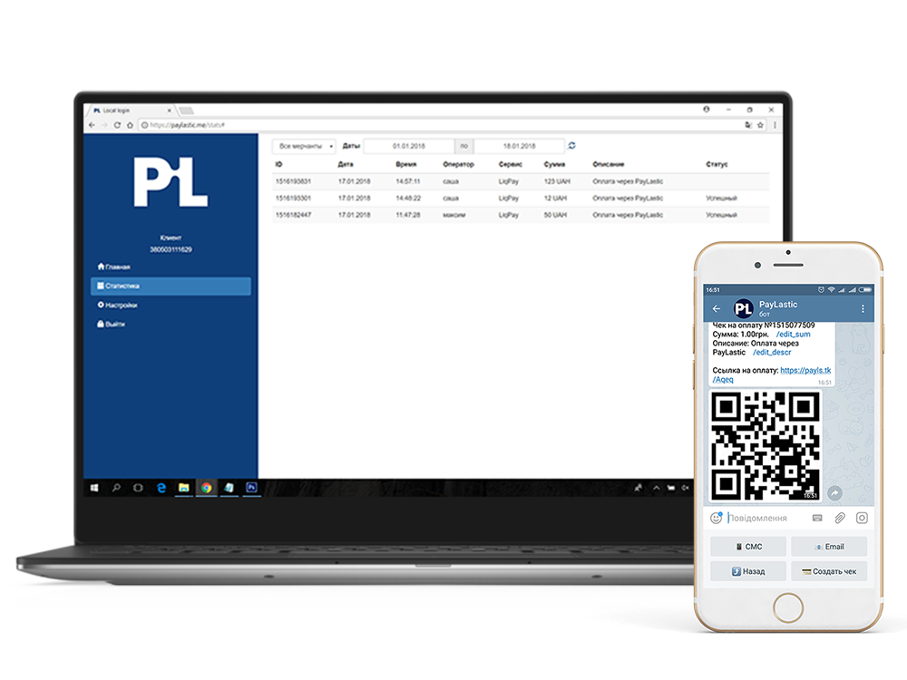

# Що таке PayLastic?

[PayLastic](https://paylastic.me/) \(укр. - Пейластік\) - це іноваційний сервіс мобільного еквайрінгу для проведення безконтактних розрахунків платіжними картками за товари та послуги без використання терміналів або спеціально програмного забеспечення.

Завдяки використанню технології чатботів у популярних месенджерах [Telegram](https://t.me/paylasticbot), [Viber](https://viber.com/paylastic) и [Facebook](https://m.me/paylastic), процес безготівковї оплати став доступним будь-якому торговцю зі смартфоном.

Використання іноваійного подходу дозволяє використовувати PayLastic у будь-якій сфері бізнесу, починаючи від вуличної торгівлі та доставки їжі, закінчуючи таксі та курьерами поштових компаній.  

Організація та управління процесом оплати виконується за допомогою спеціальної внутрішньої екосистеми або [кабінету](https://paylastic.me/signin), де власник бізнесу самостійно налаштовує мерчанти,  користувачів, операторів, формат призначення платежу, формує статистику та багато іншого. [Налаштування кабінету](https://paylastic.gitbook.io/paylastic-oshad/~/edit/drafts/-LFDYYujBykyzRyNwtBh/nalashtuvannya-kabinetu/a.-vkhod-v-kabinet) займає всього декілька хвилин.
  

