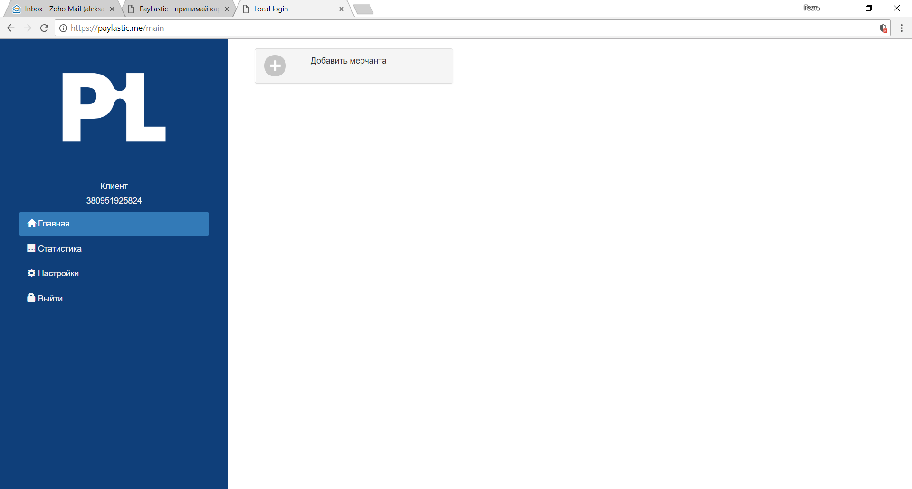
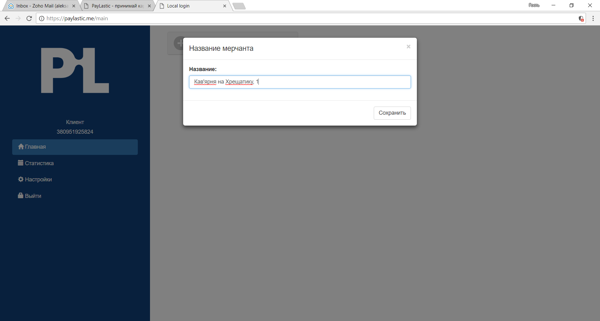
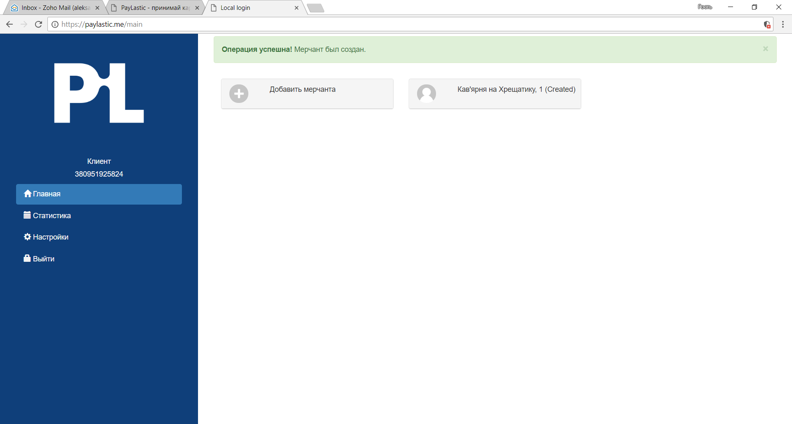
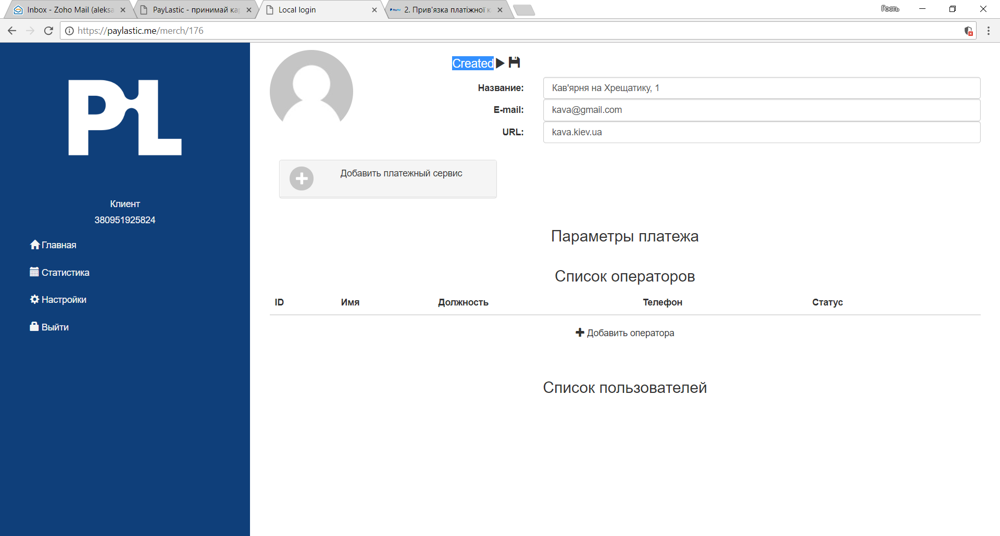
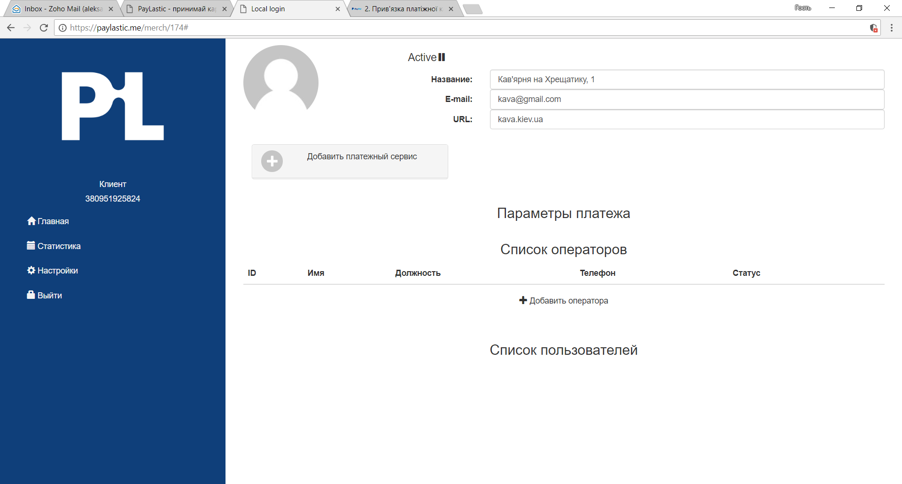

# 5.1. Создание Мерчанта

* Переходим на главную страницу Кабинета;
* Нажимаем "Добавить мерчант";

* Вводим название Мерчанта; например, "Кофейня на Крещатике";

* Нажимаем "Сохранить";
* Мерчант "Кофейня на Хрещатике" создан;


В случае необходимости, наименование Мерчанта может быть изменено в любое время по инициативе Пользователя.


* Продолжаем настройку и переходим в созданный Мерчант;
* При наличии - e-mail та адрес сайта Мерчанту;

* Сохраняем данные \([💾](http://www.fileformat.info/info/unicode/char/1f4be/index.htm)\) и активируем Мерчант \( ▶\);
* Переходим к настройкам [платежного сервіса](https://paylastic.gitbook.io/paylastic-oshad/nalashtuvannya-merchantu/2.-nalashtuvannya-platizhnogo-servisu);


Для приостановки работы Мерчанта, необходимо возле пункта **Active** нажать символ \(**\|\|**\).


