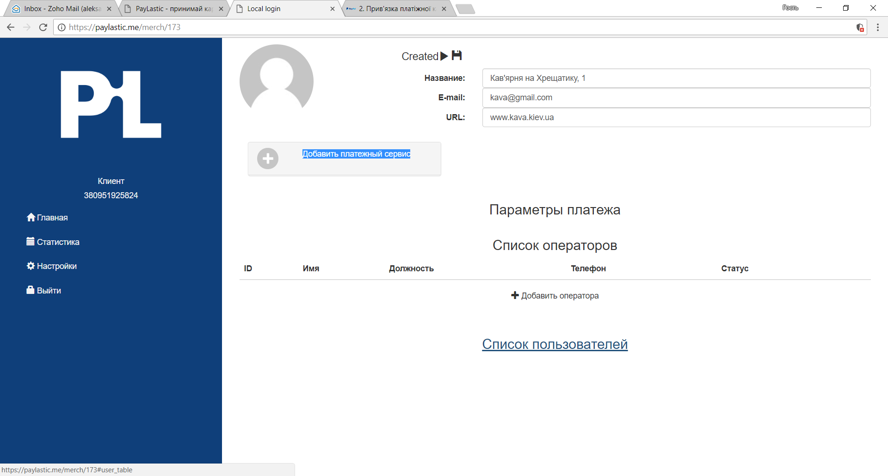
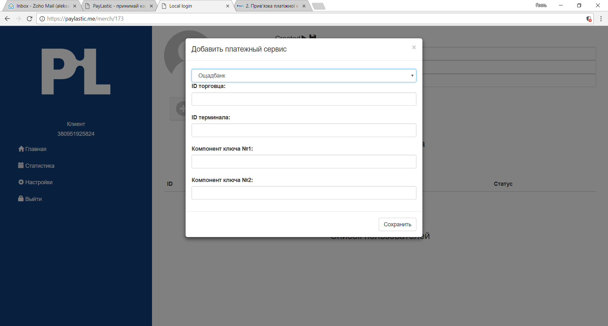
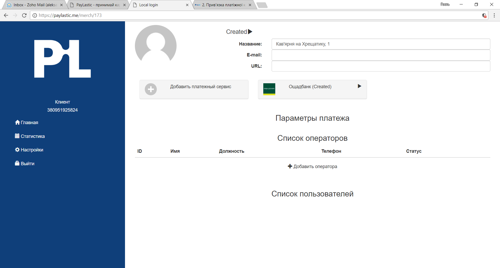

# 5.2. Настройка платежного сервиса


На этот этапе выполняется настройка подключения сервиса платежного партнера, с которым Пользователь заключил договор интернет-эквайринга.  
Подключение возможно только при наличии необходимых компонентов, согласно требований конкретного платежного партнера \(ключи, ID торговца и т.п.\).

Отсутствие какого-либо из обязательных элементов не позволит осуществить прием платежей в пользу Пользователя.


* Нажимаем "Добавить платежный сервис";

* В перечне платежных партнеров выбираем банк или компанию, с которой у вас заключен договор на предоставление услуг интернет-эквайринга;
* Вводим необходимые атрибуты в соответствующие поля;
* Нажимаем "Сохранить";

* После сохранения - нажимаем "Старт" \( ▶\); статус изменится на \(**\|\|**\) _"пауза"_;

* Платежный сервис активирован.


В случае необходимости, платежний сервис может может быть приостановлен путем  нажатия на символ \(\|\|\); повторная активация возможна путем нажатия на символ \(▶\).


