# D. Оплата


По состоянию на 20.06.2018 доступна активация только в мессенджерах Viber и Telegram. Сервис на базе Facebook Messenger - в стадии разработки.


## Действия Оператора \(Продавца\)


Ініціація оплати або формування платіжного інвойсу виконується Оператором за допомогою чатботу PayLasic у месенджері, у якому відбувалася [активація](https://paylastic.gitbook.io/paylastic-oshad/~/edit/drafts/-LFRiezl1UKquOR0SyTC/sho-take-merchant/untitled/untitled).


#### На прикладі месенджера Viber

* Входимо до месенджера;

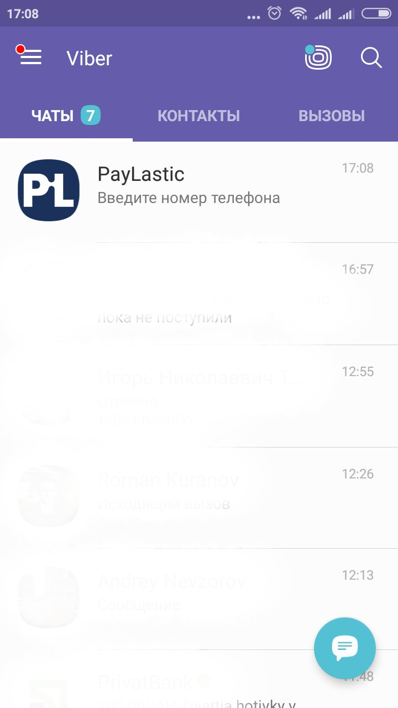

* Переходимо до чатботу PayLastic;

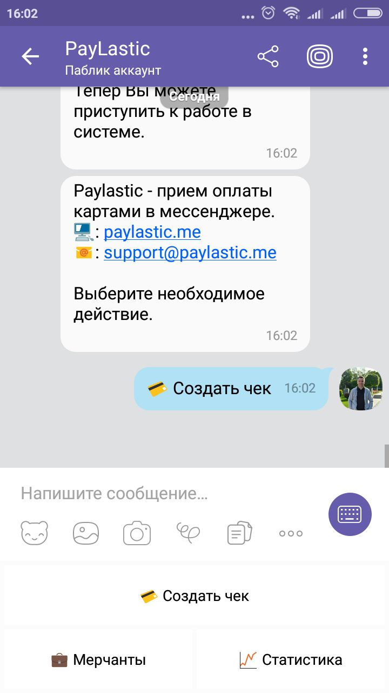

* Тиснемо кнопку "Створити чек";
* Вводимо та надсилаємо суму у гривні для розрахунку \(наприклад, 12 гривень\);

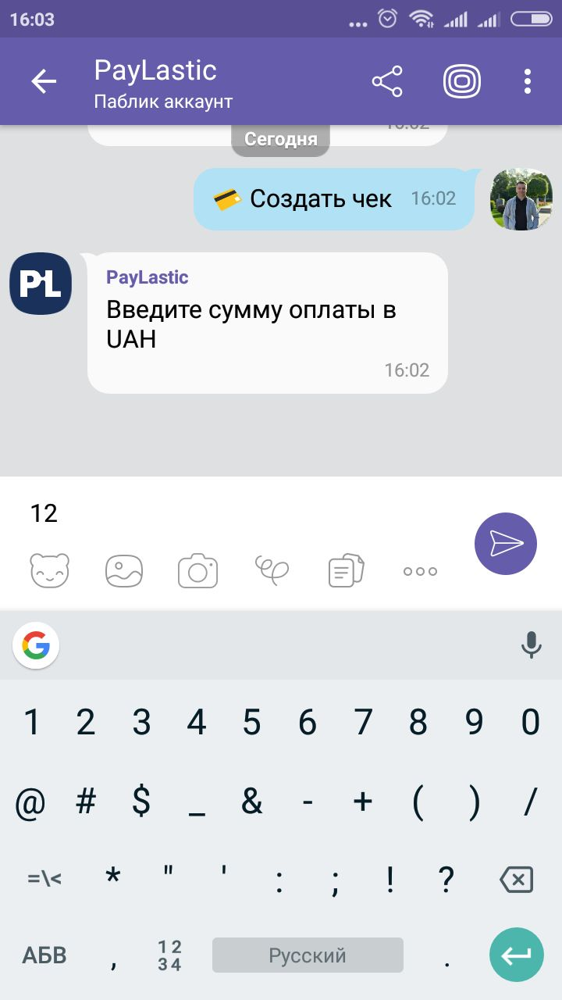

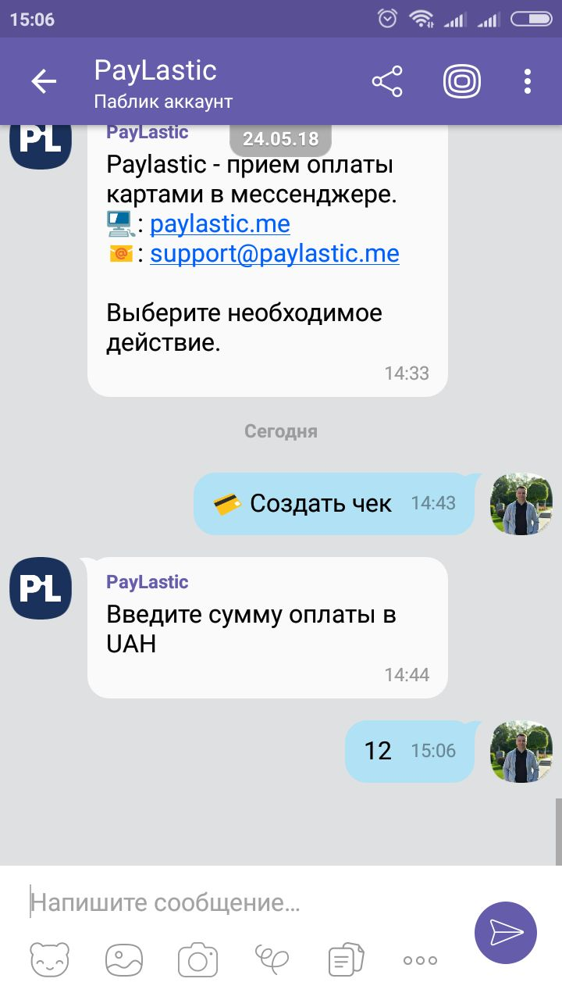

* Система автоматично повертає платіжне посилання на оплату та відповідний QR код, за яким Покупець може розрахуватися за товар або послугу;

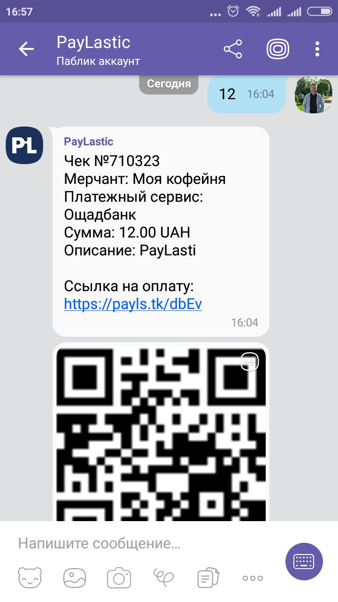

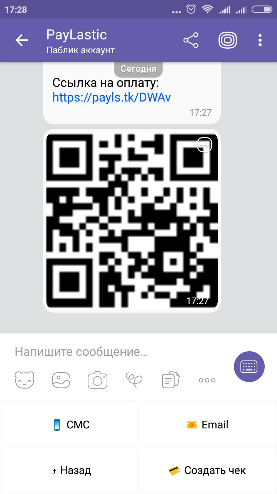


Для завершення розрахунку, Оператору необхідно передати Покупцеві платіжне посилання на своєму смартфоні; це можна зробити наступним чином запропонувавши наступне:

Варіант 1. Відсканувати QR код смартфоном Покупця зі смартфону Оператора за допомогою будь-якого сканера QR коду \(наприклад, у месенджері Viber є вбудований сканер QR коду\);  
Варіант 2. Надіслати платіжне посилання Покупцю за допомогою SMS або e-mail.


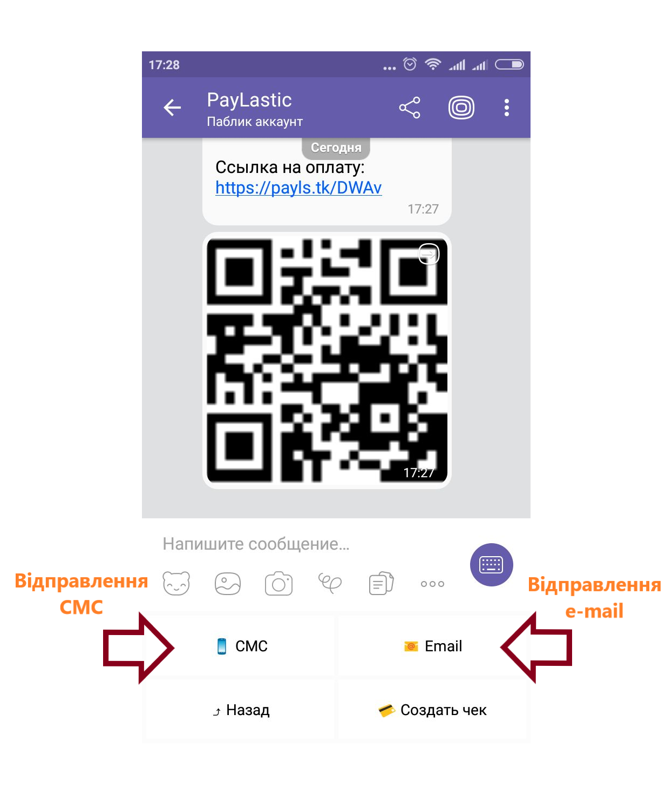

## Дії Покупця


Приймаючі до уваги потенційний ризик шахрайства, категорично рекомендується виконувати всі наступні дії виключно за допомогою смартфону Покупця та не вводити дані платіжної картки на смартфоні Оператора.


* Використовуючі будь-який QR сканер скануємо код, сформований на смартфоні Оператора; 

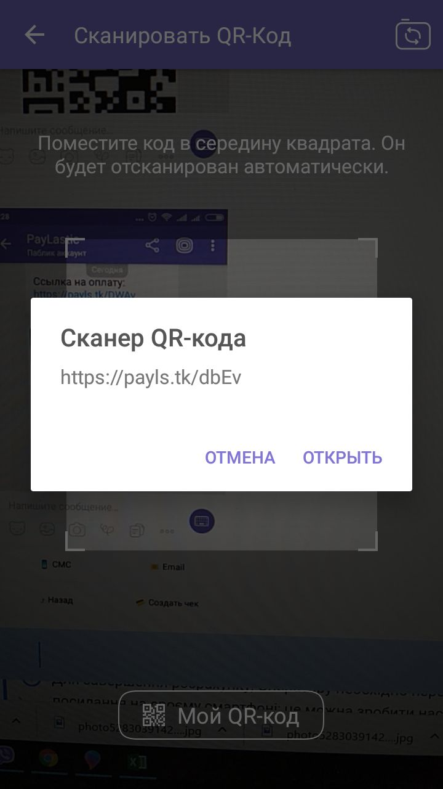

* Переходимо за посиланням на платіжну сторінку Банку;

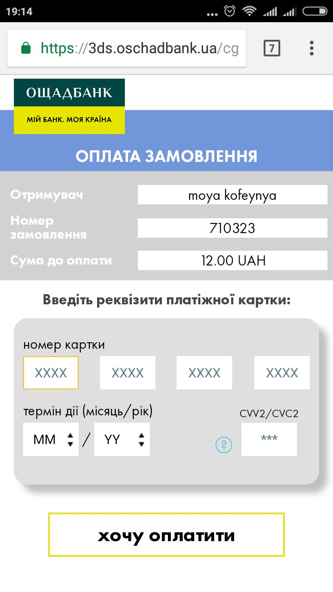

* Вводимо дані платіжної картки та натискаємо "Хочу оплатити";

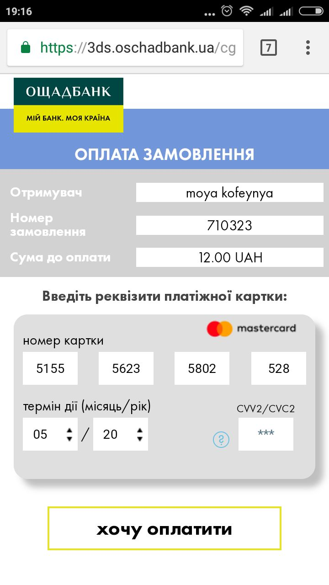

* Після оплати система автоматично переведе Покупця на сторінку PayLastic.

## Дії Оператора \(Продавця\)


Після оплати Оператор отримає відповідне повідомлення у чаті месенджеру щодо статусу операції


### У разі успішної операції

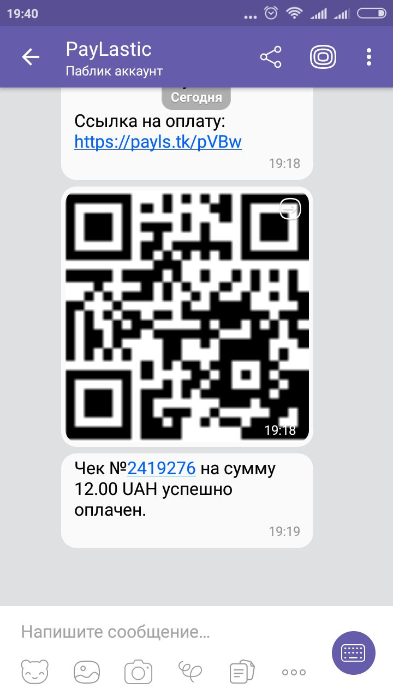

### У разі неуспішної операції

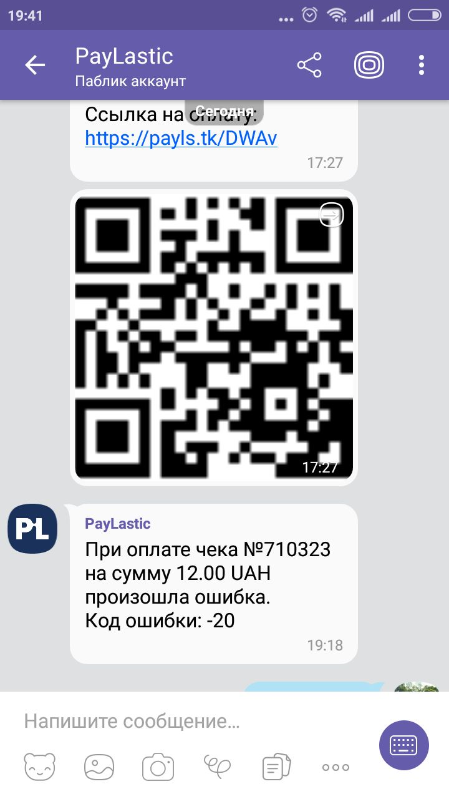

