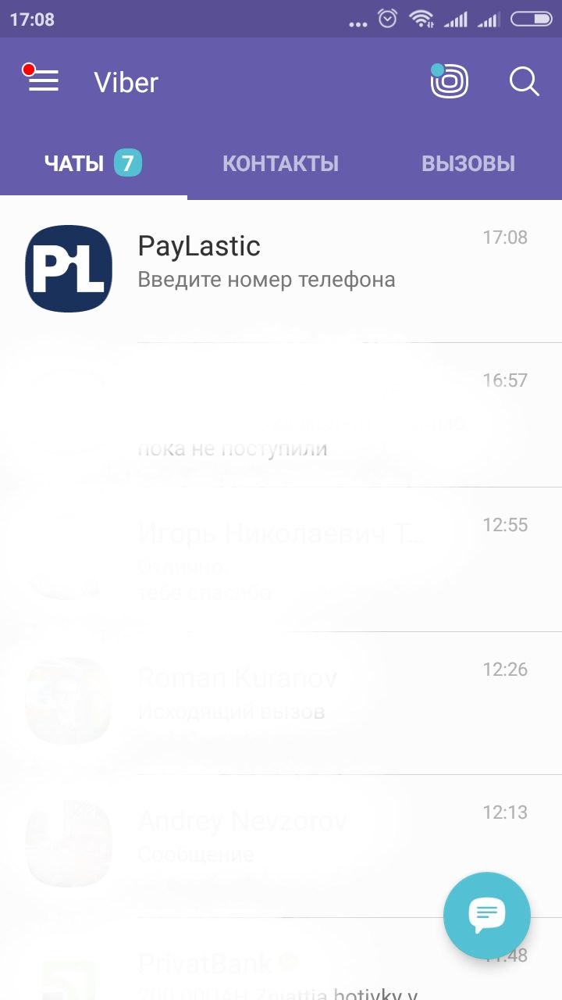
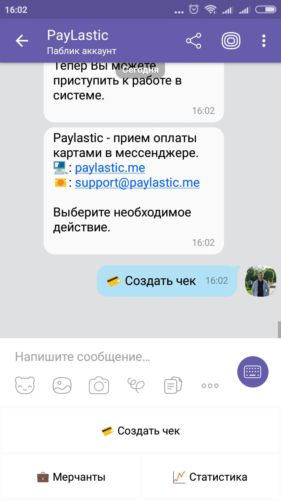
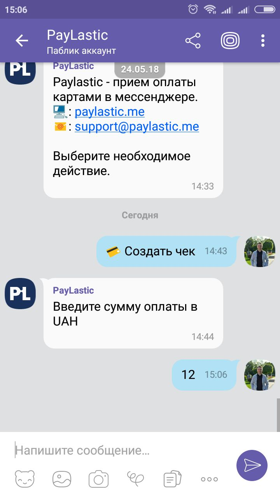
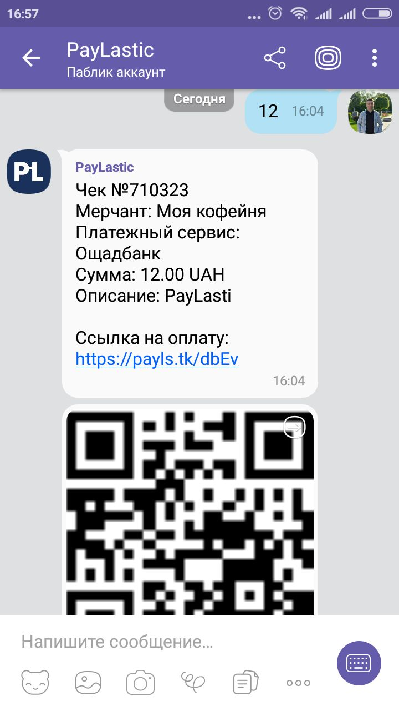
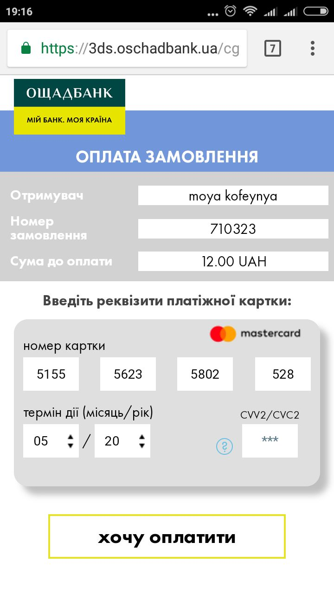
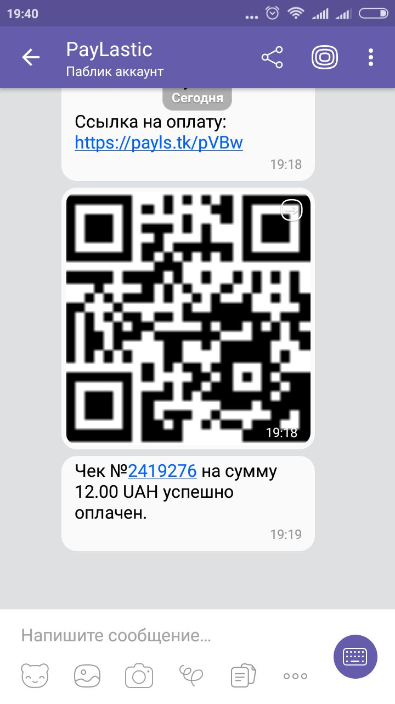

# 6. Процесс оплаты

## Действия Оператора \(Продавца\)

#### На примере мессенджера Viber

* Входим в мессенджер, который использовали при активации Оператора;

* Переходим в чатбот PayLastic;

* Нажимаем кнопку "Создать чек";
* Вводим и отправляем сумму оплаты \(например, для Украины, 12 гривен\);


Сумма оплаты указывается в национальной валюте страны, в которой зарегистрирован телефон Пользователя, под которым осуществлен вход в учетную запись PayLastic.


* Система автоматически формирует платежный инвойс в виде ссылки и QR кода, с помощью которого Покупатель сможет рассчитаться  за товар или услугу;

Для завершения расчета, Оператору необходимо предложить Покупателю получить платежный инвойс следующими способами:

* Вариант 1. Отсканировать QR код с помощью любого сканера QR коду \(к примеру, встроенного у мессенджер Viber\);
* Вариант 2. Отправить платежную ссылку на телефонный номер Покупателя посредством SMS или на его e-mail.

## Действия Покупателя


В **целях** **безопасности**, все операции по оплате инвойса \(сканирование QR, ввод номера карты и тп\) необходимо выполнять **исключительно в смартфоне Покупателя**.


* При помощи любого сканера QR кода сканируем код, сформированный Оператором в чатботе PayLastic; 

* Переходим по ссылке на платежную страницу платежного сервиса или банка;

* Вводим данные платежной карты;

Данные платежной карты можно ввести следующими способами:

* 

## Действия Оператора \(Продавца\)


По итогам проведения расчета, Оператор получит сообщение о статусе проведенной оплаты


### В случае успешной операции

### В случае неуспешной операции

### Пример проведения платежа

