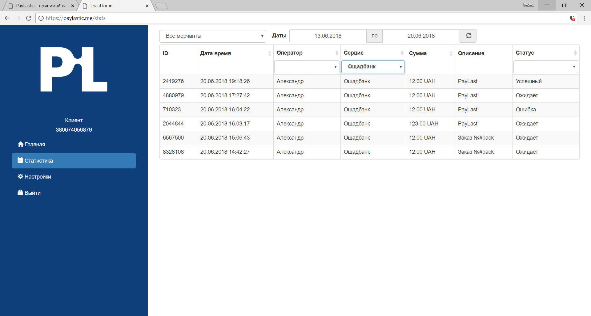

# 7. Статистика



Статистика сервісу PayLastic дозволяє у реальному часі отримати інформаціє щодо:

* Мерчанту;
* Оператора;
* Дати та часу операції;
* Суми операції;
* Опису операції;
* Статусу операції. 

Щоб отримати статистику:

* Заходимо до Кабінету;
* Переходимо у розділ "Статистика";
* За допомогою фільтрів обираємо потрібну інформацію. 

