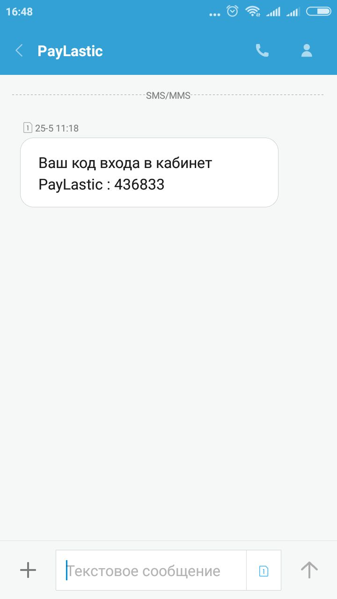
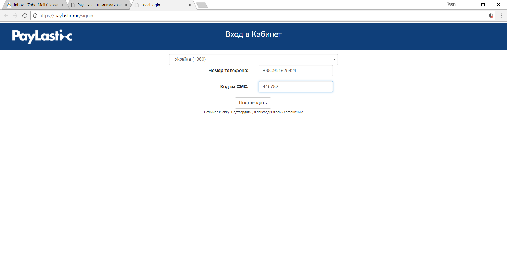
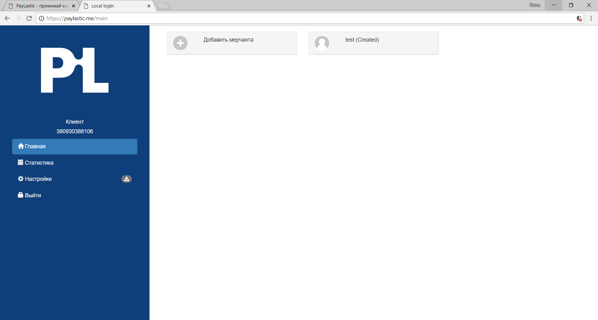

# 3.1. Вход в Кабинет


Внимание!  
При регистрации Пользователь использует только свой номер мобильного телефона.


* Вход в кабинет по ссылке:   - [https://paylastic.me/](https://paylastic.me/) -&gt; далее в раздел "Кабинет";  - или по прямой ссылке [https://paylastic.me/signin](https://paylastic.me/signin);
* Указываем номер мобильного телефона Пользователя;
* Получаем СМС с временным паролем;

* Вводим его в поле "Код из СМС";
* Нажимаем "Подтвердить";

* Вход в Кабинет выполнен успешно.

