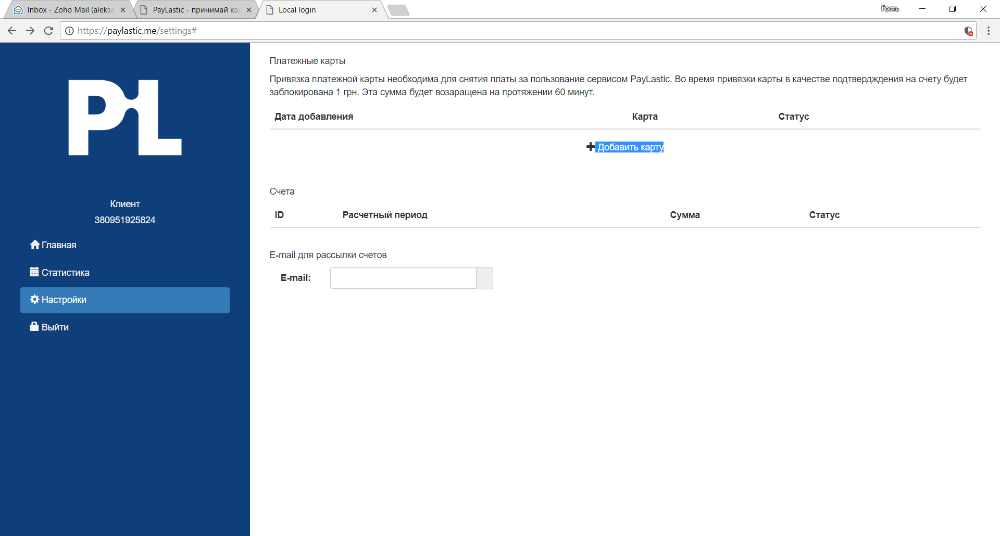
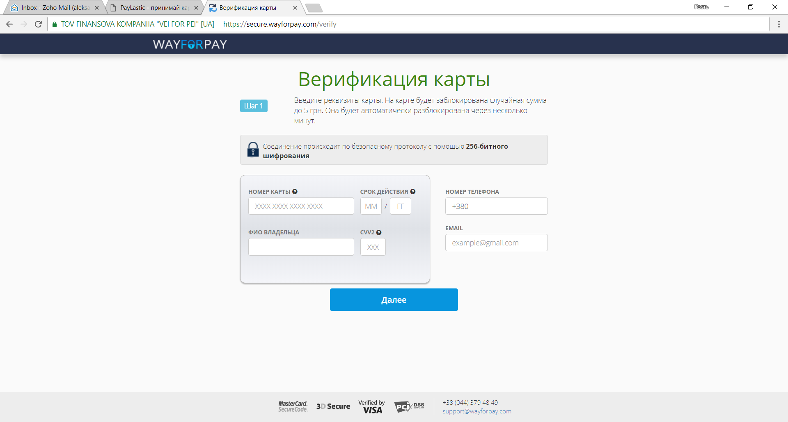
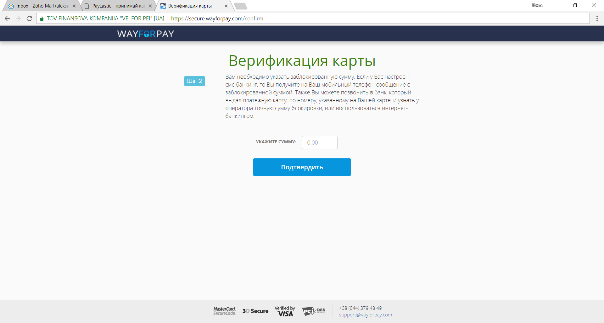
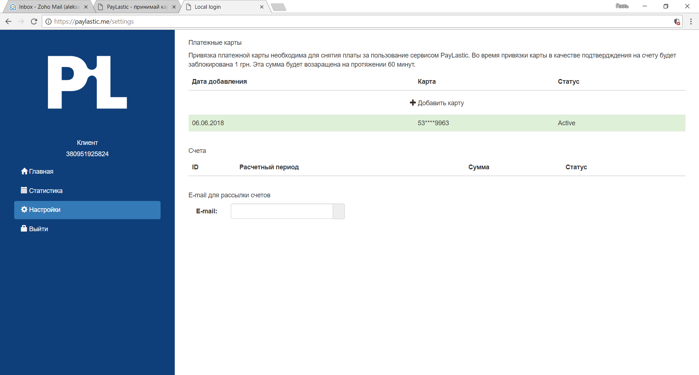

# 3.2. Привязка платежной карты


Привязка платежной карточки необходима для проведения автоматического расчета за пользование сервисом.

[Тариф](https://paylastic.gitbook.io/paylastic-oshad/~/edit/drafts/-LFDjkjtBRxaMSWnLuDa/tarifi)ы за пользование сервисом PayLastic.


* Переходим в раздел "Настройки";
* Нажимаем "Добавить карту";

* Система автоматически переводит Пользователя на безопасную страницу;
* Вводим данные платежной карты \(номер, строк дії, CVV2, имя владельца\) и дополнительные поля \(номер телефона, e-mail\);
* Нажимаем "Далее" и переходим на следующую страницу;


Сума коштів \(до 5-ти гривень\) тимчасово блокується для перевірки коректності операції та повертається на картку протягом одної години.


* Вказуємо суму коштів, що були тимчасово заблоковані на картці; 
* Тиснемо "Підтвердити";


Если у Пользователя настроено СМС информирование о блокировке - сумма временной блокировки приходит в тексте транзакционного СМС.  
В противном случае, сумму блокировки можно уточнить в выписке по платежной карте. 


* После успешной привязки платежной карты - система автоматически возвращает Пользователя в Кабинет.


Для изменения данных платежной карты \(окончание срока действия и т.п.\), необходимо добавить данные новой карты, после чего можно удалить данные предыдущей карты.


