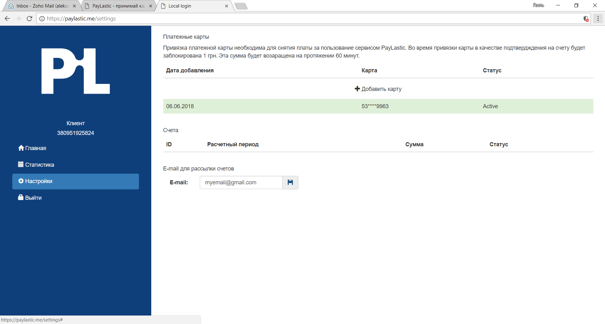

# 3.3. Е-mail для платежных квитанций


E-mail необходим для получения электронных копий платежных документов после удержания ежемесячной оплаты за пользование сервисом.


* В разделе «Настройки» указываем электронный адрес, куда будут автоматически направляться электронные копии документов;
* нажимаем на значок [💾](http://www.fileformat.info/info/unicode/char/1f4be/index.htm) \(_Сохранить_\).


В случае необходимости, e-mail может быть заменен по инициативе Пользователя.


