# 4.1. Настройка Оператора


Обязательным условием проведения оплаты является наличие у Оператора:  
- смартфона с операционной системой Android или iOS;  
- установленным мессенджером Viber, Telegram или Facebook Messenger \(на выбор Оператора\);  
- наличие интернет соединения.



По состоянию на 20.06.2018 доступна активация только в мессенджерах Viber и Telegram. Сервис на базе Facebook Messenger - в стадии разработки.



Настройка роли Оператора может будет сделано только Пользователем независимо от Роли.



В случае необходимости оператор может параллельно использовать другие мессенджеры \(Viber, Telegram или Facebook Messenger\). 

Для этого Оператору необходимо пройти повторную активацию в соответствующем мессенджере одним из описанных способов.  
Способ 1. Необходимо найти чатбот PayLastic в соответствующем мессенджере и пройти активацию в мессенджере, описанную ниже;   
Вариант 2. Перейти по ссылке, полученной в СМС при первичной регистрации Оператора \([https://paylastic.me/go](https://paylastic.me/go)\), выбрать нужный мессенджер и пройти активацию в мессенджере, описанную ниже.

**Внимание! Повторно регистрировать Оператора в Мерчанте не требуется.**


* Выбираем пункт "Список операторов";
* Нажимаем "Добавить оператора".

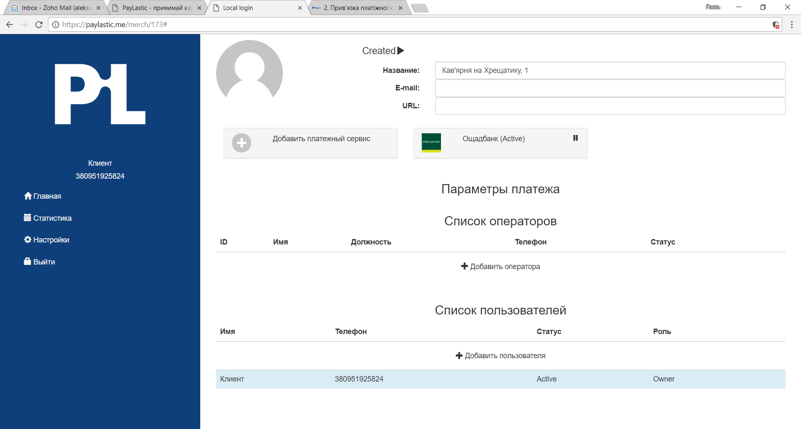

* Указываем имя, должность и обязательно - номер телефона; 
* Сохраняем настройки.


Номер мобильного телефона Оператора является обязательным.


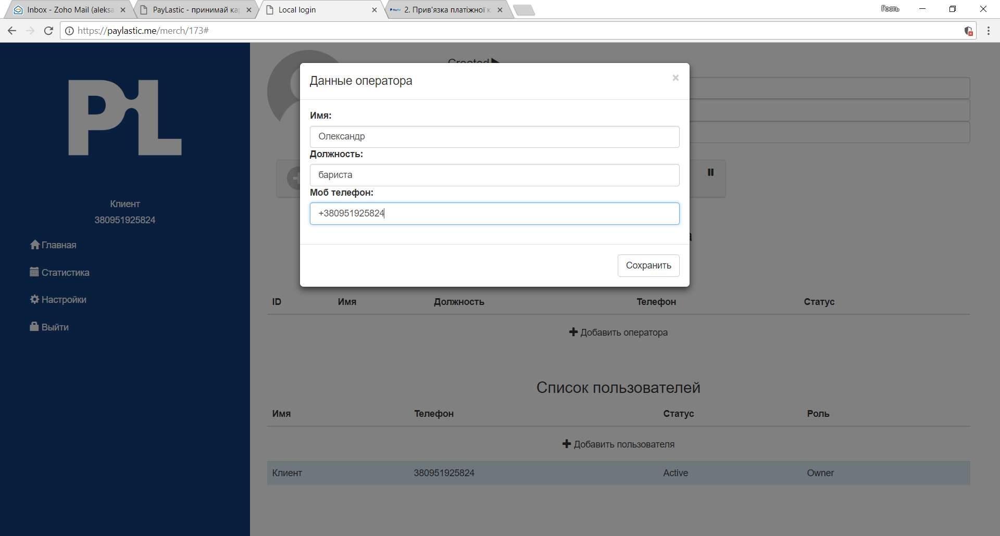

* Для активации Оператора нажимаем символ **Created ➹** \(_Созданный_\), после чего он автоматически изменяется на **Pending** \(_Ожидает рассмотрения_\);

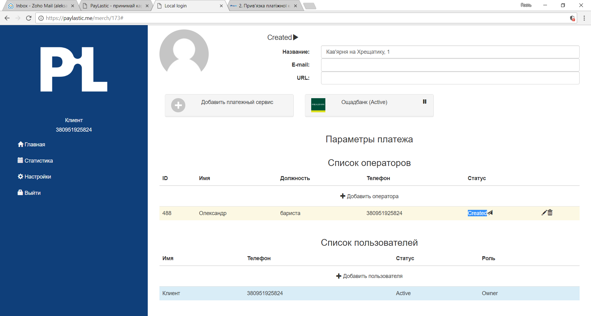

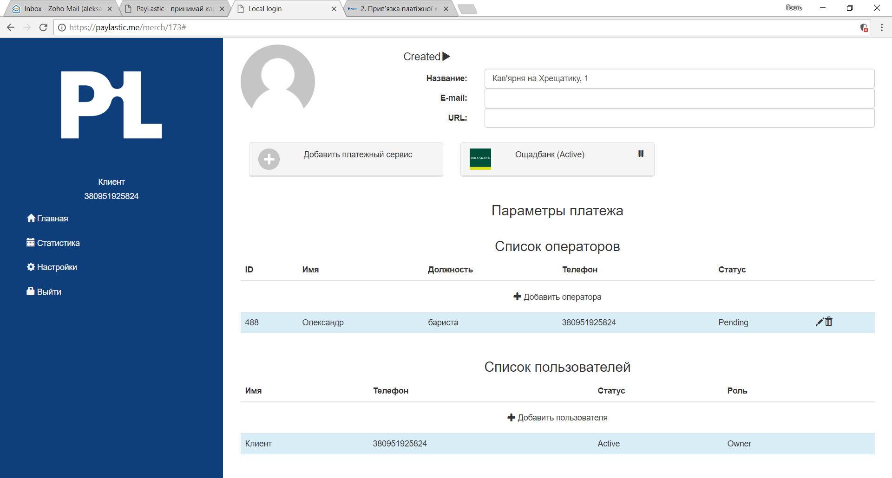

* Система автоматически отправляет Оператору СМС от альфа имени PayLastic со ссылкой   [https://paylastic.me/go](https://paylastic.me/go); 

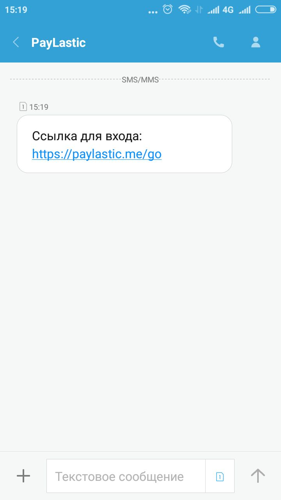

* Переходим по ссылке;

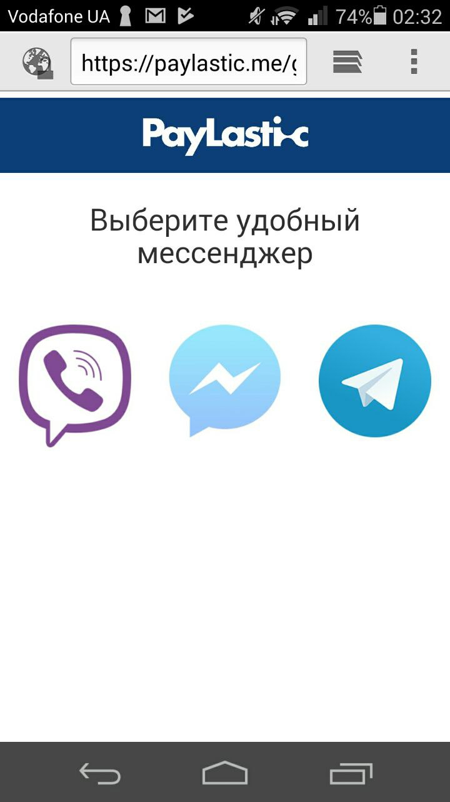

* Выбираем мессенджер \(нажимаем на иконку мессенджера\), с помощью которого будем управлять процессом расчета с клиентами; например, это Viber;
* Система автоматически переводит нас к чатбот PayLastic в Viber; далее - идем по подсказкам;

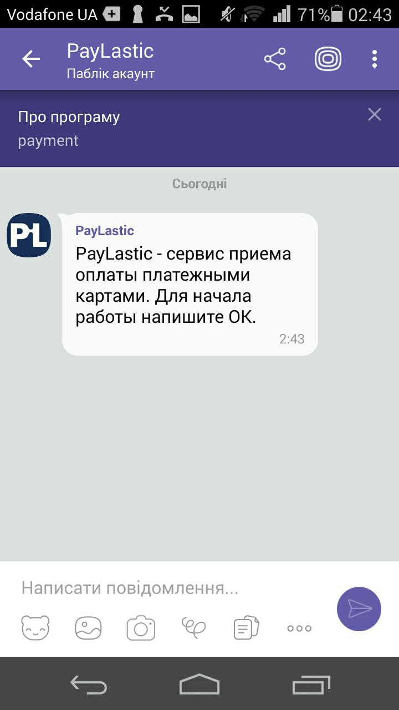

* Пишем чатботу Ок или что-либо другое;

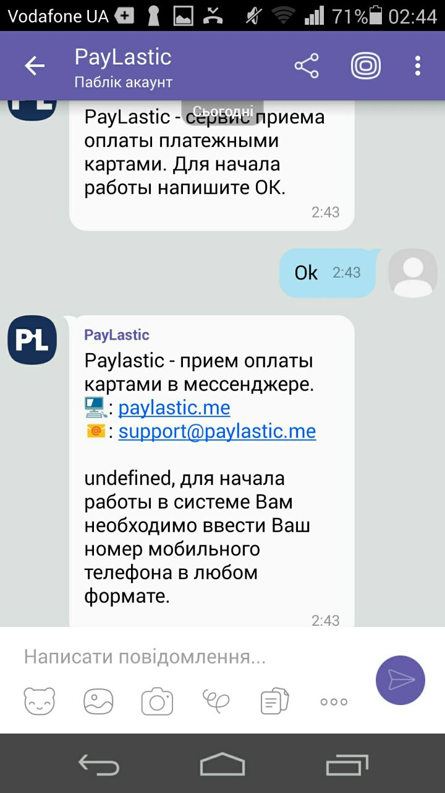

* Вводим номер телефона Оператора, который был указан при регистрации;

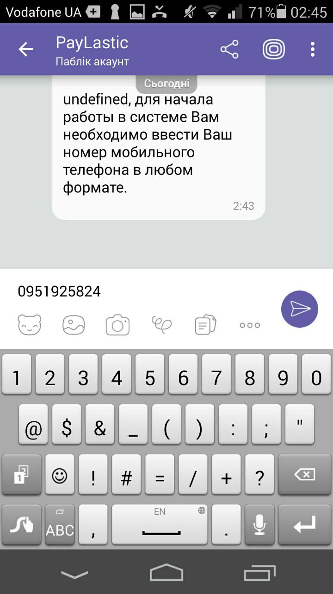

* Получаем СМС с паролем и отправляем его чатботу;

* Получаем приветствие от чатбота с указанием имени Оператора и наименования Мерчанта;

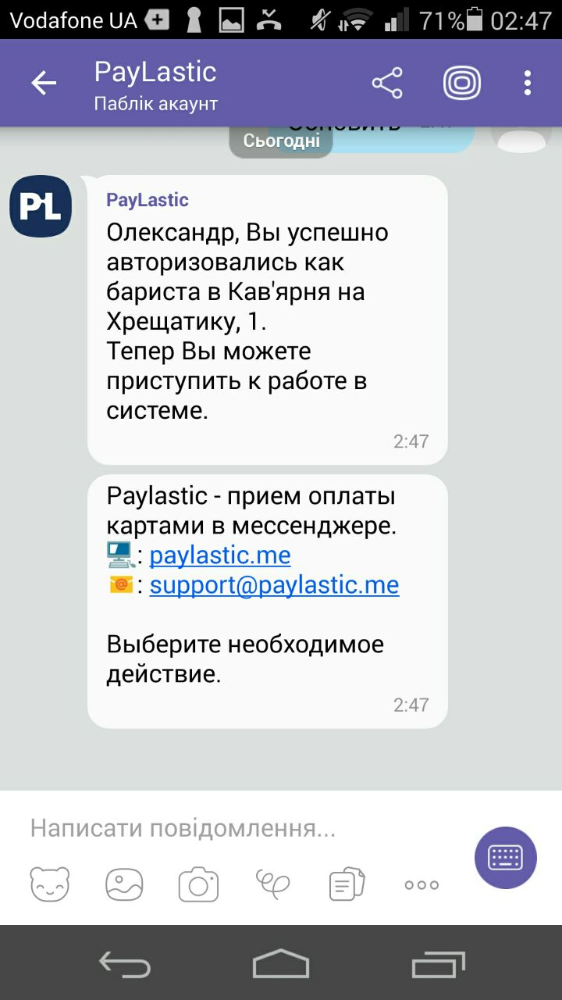

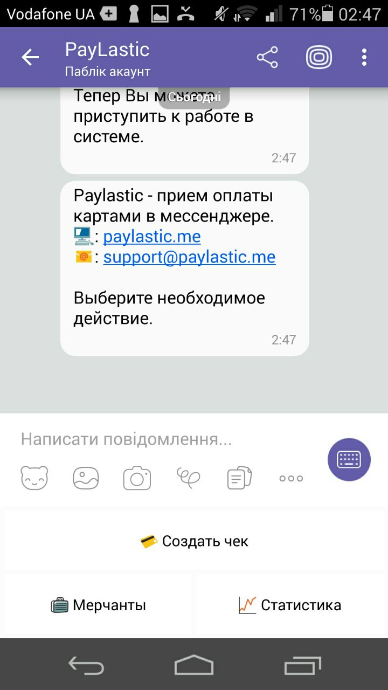

* Возвращаемся в Кабинет - статус Оператора изменился на **Active** \(_Активный_\);
* Налаштування Оператора успішно завершено та він готовий для отримання розрахунків платіжними картками.

### Управление статусом Оператора

В случае необходимости Пользователь может присвоить Оператору следующие статусы:

* **временно приостановить** - нажимаем \(**\|\|**\);  
* **активировать** -  нажимаем ▶;  
* **откорректировать** \(кроме данних телефона\) - нажимаем ✐;   
* или **удалить** - нажимаем  [**🗑**](http://graphemica.com/🗑).


Изменение номера телефона активного Оператора приведет к деактивации статуса Оператора в Мерчанте и необходимости повторной активации.



Будьте внимательны - в случае удаления, данные не восстанавливаются.


