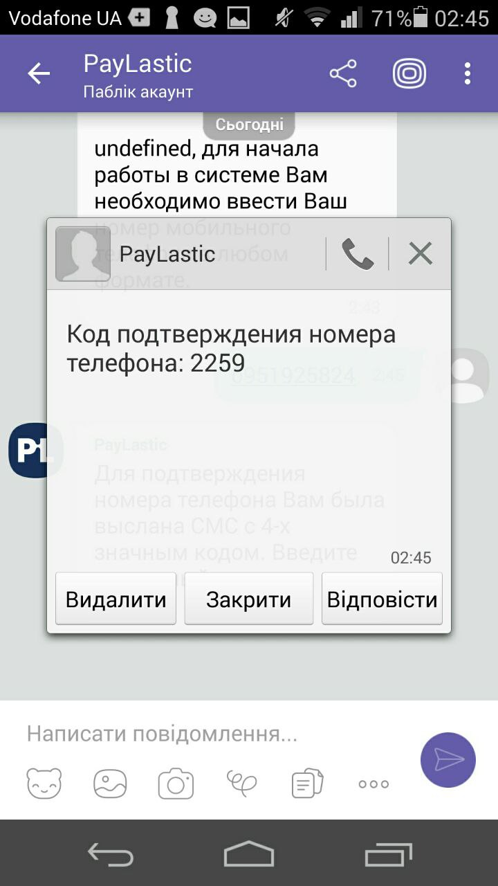
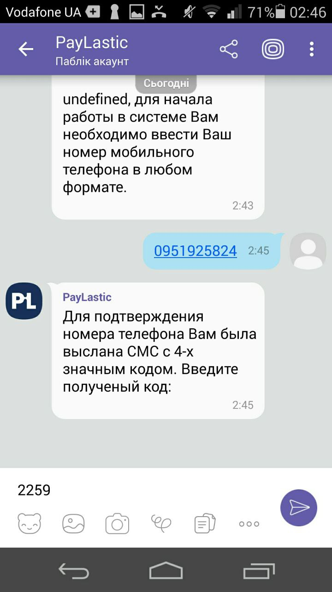

# 1. Настройка Оператора


Обязательным условием проведения оплаты является наличие у Оператора:  
- смартфона с операционной системой Android или iOS;  
- установленным мессенджером Viber, Telegram или Facebook Messenger \(на выбор Оператора\);  
- наличие интернет соединения.



По состоянию на 20.06.2018 доступна активация только в мессенджерах Viber и Telegram. Сервис на базе Facebook Messenger - в стадии разработки.



Налаштування ролі Оператора може буде зроблено только Користувачем незалежно від Ролі.



У разі необхідності Оператор може паралельно використовувати інші месенджери \(Viber, Telegram або Facebook Messenger\).  
Для цього Оператору пройти повторну активацію у відповідному месенджері одним з описаних варіантів.

Варіант 1. Необхідно знайти відповідний чатбот PayLastic у відповідному месенджері та пройти активацію у месенджері, описану нижче;  
Варіант 2. Перейти за посиланням, отриманим у СМС при первинній реєстрації Оператора \([https://paylastic.me/go](https://paylastic.me/go)\), обрати потрібний месенджер та пройти активацію у месенджері, описану нижче.

_**Увага! Повторно реєструвати Оператора у Кабінеті не потрібно.**_


* Обираємо "Список операторів";
* Натискаємо "Додати оператора".

* Вказуємо Ім'я , Посаду оператора та номер мобільного телефону Оператора; 
* Зберігаємо налаштування.


Номер мобільного телефону Оператора є обов'язковим.


* Для активації Оператора натискаємо символ Created ➹ \(_Створений_\), після чього від зміються на Pending \(_Очікує на розгляд_\);

* Оператор отримує СМС повідомлення з альфа імені PayLastic з посиланням  [https://paylastic.me/go](https://paylastic.me/go); 
* Переходимо за отриманним посиланням;

* Обираємо мессенджер \(натискаємо на іконку\), за допомогою якого будемо ініціювати розрахунки картками; наприклад, це Viber;
* Система автоматично переводить нас до чатботу PayLastic у Viber; далі - йдемо за підказками;

* Пишему чатботу Ок або будь-що інше;

* Вводимо номер телефону Оператора, що був зазначений під час реєстрації;

* Отримуємо СМС с паролем та надсилаємо його чатботу;

* Отримуємо привітання від чатботу з ім'ям Оператора та найменуванням Мерчанту;

* Повертаємося до Кабінету - статус Оператора змінився на Active;
* Налаштування Оператора успішно завершено та він готовий для отримання розрахунків платіжними картками.



У разі необхідності Оператор може бути:

* **тимчасово призупинений** - натискаємо \(\|\|\);  
* **активований** -  натискаємо ▶;  
* **відкорегований** \(окрім даних телефону\) - натискаємо ✐;   
* або **видалений** - натискаємо  [🗑](http://graphemica.com/🗑).


Будьте уважні - у разі видалення данні відновити неможливо.


